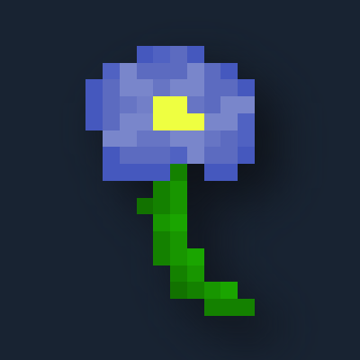

# Vertigoes (1.21.1)

A small Minecraft NeoForge mod adding some random things that maybe you'd like, check [modding.damocles.dev/vertigoes](https://modding.damocles.dev/vertigoes) for what's added.

I recommend JEI to see in-game descriptions.

Download links:
- [Modrinth](https://modrinth.com/mod/vertigoes)
- [CurseForge](https://www.curseforge.com/minecraft/mc-mods/vertigoes)

For issues please use [github.com/damoc1es/vertigoes-mod/issues](https://github.com/damoc1es/vertigoes-mod/issues/).
